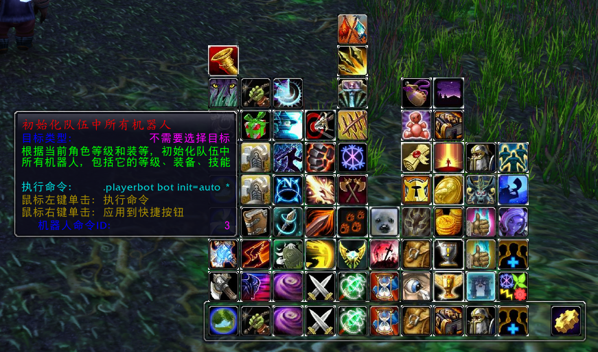
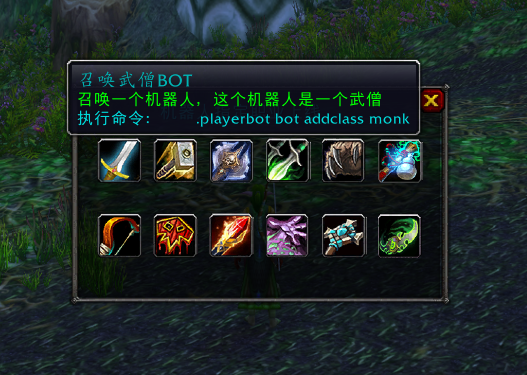

## UnBot for BfaCore 

一个基于 unbot-addon 修改的，适配 BfaCore（版本8.3.7） 的机器人控制插件，方便控制机器人（基于Playerbot mod）。

目前仅对中文客户端有较好支持。

安装方式：将 UnBot 和 YssBossLoot 放至 Interface/AddOns/ 目录下

插件界面展示：

添加指定职业机器人（已加入武僧、恶魔猎手，需配合bfacore带playerbot的服务端）：

